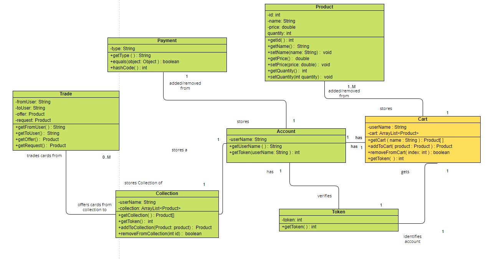
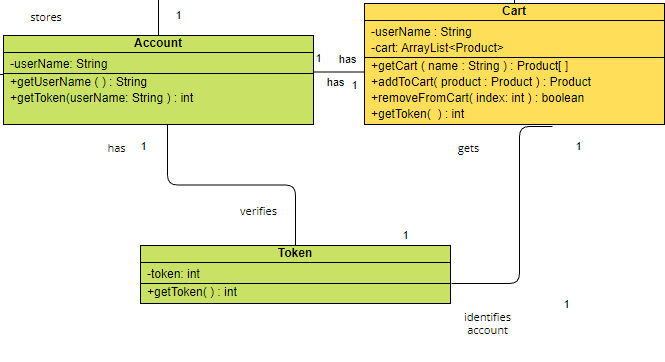
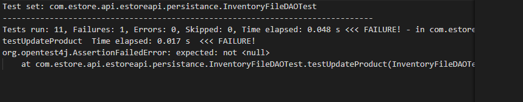

# PROJECT Design Documentation

## Team Information
* Team name: CARDSHARKS
* Team members
  * Ryan Schachel
  * Josh Matthews
  * Elijah Lenhard
  * Adrian Marcellus
  * Rohan Rao

## Executive Summary
This is a summary of the project.

### Purpose
This e-store is an online hub that allows users to buy, sell, and trade their trading cards with ease. Our e-store's special trading feature supports fast and easy card trading between users. Customers can expand their card collection like never before. 

### Glossary and Acronyms

| Term | Definition |
|------|------------|
| API | Application Programming Interface |
| REST | Representational State Transfer(An industry standard for creating APIs) |
| SPA | Single Page |
| Persistance | Ability to store and access data across sessions and processes | 

## Requirements

This section describes the features of the application.

> _In this section you do not need to be exhaustive and list every
> story.  Focus on top-level features from the Vision document and
> maybe Epics and critical Stories._

### Definition of MVP

In our first working increment, the CardSharks e-store allows users to login and see their collection. On the store, Customers view a full list of products and a search bar for quickly locating coveted cards. Patrons have access to a shopping cart to add and remove items as well as proceed to checkout.
The e-store owners can modify the inventory as items are bought and sold. Our e-store handles day to day data persistence, letting users instantly see up-to-date inventory counts.

### MVP Features
>  _**[Sprint 4]** Provide a list of top-level Epics and/or Stories of the MVP._

### Enhancements
> _**[Sprint 4]** Describe what enhancements you have implemented for the project._

## Application Domain

This section describes the application domain.

A Customer or Admin can Log-In and use the E-Store. The E-Store mediates the selling, buying, and trading of Products. These Products can be added/removed from a Customers Cart or added/deleted from the inventory by an Admin. The Search Bar searches for Products so that a Customer can find them quickly. Each Users Account has a Collection that stores the cards they own. A User can trade cards from their Collection to another User in exchange for a card in the other Users collection. 

## Architecture and Design

This section describes the application architecture.

### Summary

The following Tiers/Layers model shows a high-level view of the webapp's architecture.

The e-store web application, is built using the Model–View–ViewModel (MVVM) architecture pattern. 

The Model stores the application data objects including any functionality to provide persistance. 

The View is the client-side SPA built with Angular utilizing HTML, CSS and TypeScript. The ViewModel provides RESTful APIs to the client (View) as well as any logic required to manipulate the data objects from the Model.

Both the ViewModel and Model are built using Java and Spring Framework. Details of the components within these tiers are supplied below.

The e-store web application, is built using the Model–View–ViewModel (MVVM) architecture pattern.​The Model stores the application data objects including any functionality to provide persistance.​The View is the client-side SPA built with Angular utilizing HTML, CSS and TypeScript. The ViewModel provides RESTful APIs to the client (View) as well as any logic required to manipulate the data objects from the Model.​Both the ViewModel and Model are built using Java and Spring Framework. Details of the components within these tiers are supplied below.​​

### Overview of User Interface

This section describes the web interface flow; this is how the user views and interacts
with the e-store application.

> _Provide a summary of the application's user interface.  Describe, from
> the user's perspective, the flow of the pages in the web application._

### View Tier
> _**[Sprint 4]** Provide a summary of the View Tier UI of your architecture.
> Describe the types of components in the tier and describe their
> responsibilities.  This should be a narrative description, i.e. it has
> a flow or "story line" that the reader can follow._

> _**[Sprint 4]** You must  provide at least **2 sequence diagrams** as is relevant to a particular aspects 
> of the design that you are describing.  For example, in e-store you might create a 
> sequence diagram of a customer searching for an item and adding to their cart. 
> As these can span multiple tiers, be sure to include an relevant HTTP requests from the client-side to the server-side 
> to help illustrate the end-to-end flow._

> _**[Sprint 4]** To adequately show your system, you will need to present the **class diagrams** where relevant in your design. Some additional tips:_
 >* _Class diagrams only apply to the **ViewModel** and **Model** Tier_
>* _A single class diagram of the entire system will not be effective. You may start with one, but will be need to break it down into smaller sections to account for requirements of each of the Tier static models below._
 >* _Correct labeling of relationships with proper notation for the relationship type, multiplicities, and navigation information will be important._
 >* _Include other details such as attributes and method signatures that you think are needed to support the level of detail in your discussion._

### ViewModel Tier
> _**[Sprint 4]** Provide a summary of this tier of your architecture. This
> section will follow the same instructions that are given for the View
> Tier above._

> _At appropriate places as part of this narrative provide **one** or more updated and **properly labeled**
> static models (UML class diagrams) with some details such as critical attributes and methods._
> 

### Model Tier

The Account model stores user information and provides methods to get the UserName and the Token assigned to it. Each account has an association to the Cart model. One Cart is assigned to One Account. The Cart can add products from the Product model and remove them too. The Product model stores information such as Id, Name, Price, and Quantity for each product. Finally, we have the Token model which verifies each account and identifies the account a cart is assigned to. 

## OO Design Principles

The Law of Demeter will be followed as all products have private data fields and appropriate getters and setters. The Angular framework will also inherently follow this principle with its use of components. Functionality is encapsulated within components while still allowing interaction between components without sharing internal data. We also use a controller to talk to the Data Access Object interface implementation which stores and modifies the product list in a JSON. So the Angular front end follows the principle as well as the backend. Below demonstrates how the Angular Components talk only to their immediate neighbor, a service, which talks to it’s neighbor and so on, instead of the component directly editing the files or talking to the fileDAO or Controller.

Loose coupling is the concept that systems that interact with each other shouldn’t need to care about how the work gets done. The only thing that matters is the external view of the class such as method signatures and return types. Interfaces are very helpful with enforcing this. For example, in our web application, the controller doesn’t need to worry about how the DAO implements its methods. It could be swapped out with another implementation and as long as the method signatures and return types stay the same, the app would still function. 

The Pure Fabrication pattern suggests creating a class to do work that can be reused by a class or classes. This class does not represent a domain entity. Using this design pattern, low coupling, cohesiveness, and Single Responsibility can be achieved. The sprint one stories don’t use this design pattern. As the project expands, Pure Fabrication could be applied in situations where some tasks need to be performed that are not directly related to the class that needs it. For example, the E-store or sales class will need to update the inventory data after a purchase is made, a product is created, or stock has been added. The best way to do this is to make a class that handles the data manipulation and have it call the sales class. This way the E-store and sales class can stay in a Single Responsibility state.

As stated in the lecture slides for object-oriented design, the controller acts as the separation (or go-between) for system operations and the user interface. Currently, the team’s application uses 3 controllers for the purpose of managing the inventory, accounts, and carts. Specifically, it oversees operations that include altering varias such as adding, deleting and editing these objects. Each controller has different methods since they have different requirements. As seen below the front end only communicates with the back end through http calls to these 3 controllers.

## Static Code Analysis/Future Design Improvements
> _**[Sprint 4]** With the results from the Static Code Analysis exercise, 
> **Identify 3-4** areas within your code that have been flagged by the Static Code 
> Analysis Tool (SonarQube) and provide your analysis and recommendations.  
> Include any relevant screenshot(s) with each area._

> _**[Sprint 4]** Discuss **future** refactoring and other design improvements your team would explore if the team had additional time._

## Testing
> _This section will provide information about the testing performed
> and the results of the testing._

### Acceptance Testing

There were five stories in total that had passed all their acceptance criteria tests. These were the admin inventory interaction story, search-bar story, login/logout story, homepage story, and shopping cart backend storage story. We had two stories that didn't pass all their acceptance criteria tests. These were the Add to Shopping Cart and Edit Shopping Cart stories. The issues we found during acceptence testing were related to the shopping cart. We were able to get the inventory count to go down when a product was added to the cart, but that was the extent of the shopping cart functionality. 

### Unit Testing and Code Coverage
> _**[Sprint 4]** Discuss your unit testing strategy. Report on the code coverage
> achieved from unit testing of the code base. Discuss the team's
> coverage targets, why you selected those values, and how well your
> code coverage met your targets._

We ended up writing 67 tests for our java code. We still have an unresolved test that failed in the InventoryFileDAO class. That will be a priority. 

Some tests could be detailed better so that repeat tests don't come up later in development. As of now, there are no glaring errors with the project testing.
