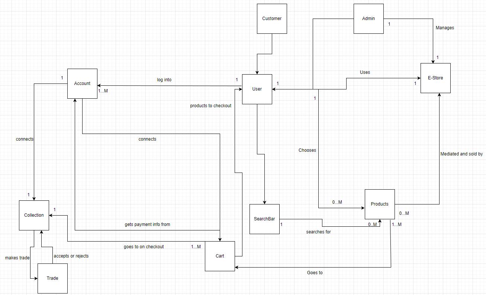
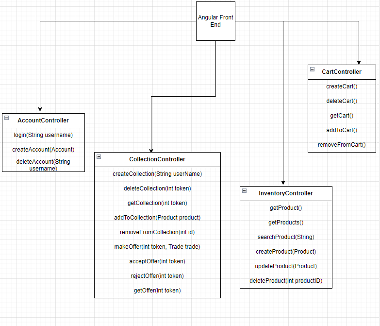
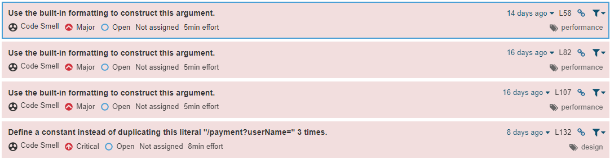

# PROJECT Design Documentation

## Team Information
* Team name: CARDSHARKS
* Team members
  * Ryan Schachel
  * Josh Matthews
  * Elijah Lenhard
  * Adrian Marcellus
  * Rohan Rao

## Executive Summary
This e-store is an online hub that allows users to buy, sell, and trade their trading cards with ease. Our e-store's special trading feature supports fast and easy card trading between users. With these seamless transactions, customers can expand their card collection like never before.

### Purpose
This design document is the blueprint of a website that enables users to buy, sell, and trade trading cards. The site consists of a user friendly interface that allows collectors to easily browse and search for their desired cards. Our customers will be able to make an offer with one of their cards and send it to another user who will then accept or decline the trade. They can also quickly make purchases by saving their payment information on-site. These features and tools will let trading card enthusiasts enjoy their hobby to the fullest. 

### Glossary and Acronyms

| Term | Definition |
|------|------------|
| API | Application Programming Interface |
| CSS | Cascading Style Sheets |
| HTML | Hypertext Markup Language |
| REST | Representational State Transfer(An industry standard for creating APIs) |
| SPA | Single Page |
| Persistence | Ability to store and access data across sessions and processes | 

## Requirements

* A user will have access to a login page where they can log in either as a customer or an admin
* A customer will have a shopping cart where they can add or remove products from it.
* An admin will have access to an inventory where they can add, update, or delete products
* A customer will have access to their homepage where they can view different cards from stock and add it to their shopping cart.
* A customer will have an option to purchase the products they add to their shopping cart.
* A customer will have an option to search for a specific product they desire.

### Definition of MVP

The CardSharks e-store MVP allows users to log in and see their collection. On the store, Customers view a full list of products and a search bar for quickly locating coveted cards. Patrons have access to a shopping cart to add and remove items as well as proceed to checkout.
The e-store owners can modify the inventory as new stock is received. Our e-store handles session-to-session data persistence, letting users instantly see up-to-date inventory counts.

### MVP Features
* Login/Logout - Customers and owners can log in to view their card collection or make changes to the e-store.
* Search for Items - A customer can search for a specific item so they can purchase it
* Add/Edit items from Shopping Cart - A customer can add items to their shopping cart so they can buy them later. They can also edit and remove items from their shopping cart.
* Checkout - Customers can review their items, add payment info, and purchase items.
* Inventory Interaction - E-store owners can edit the stores' inventory. These changes along with inventory changes due to customer purchases will be saved across sessions using data persistence.

### Enhancements
* Trade Cards - Users can trade cards from their collection to another user for one of their cards.
* Saving Payment Information - Users can add, delete, and edit their payment information so they can use it in the future.

## Application Domain

This section describes the application domain.

A Customer or Admin can Log-In and use the E-Store. The E-Store mediates the selling, buying, and trading of Products. These Products can be added/removed from a Customer's Cart or added/deleted from the inventory by an Admin. The Search Bar searches for Products so that a Customer can find them quickly. Each Users Account has a Collection that stores the cards they own. A User can trade cards from their Collection to another User in exchange for a card in the other Users collection. 

## Architecture and Design

This section describes the application architecture.

### Summary

The following Tiers/Layers model shows a high-level view of the web app's architecture.

The e-store web application is built using the Model–View–ViewModel (MVVM) architecture pattern. 

The Model stores the application data objects including any functionality to provide persistence. 

The View is the client-side SPA built with Angular utilizing HTML, CSS, and TypeScript. The ViewModel provides RESTful APIs to the client (View) as well as any logic required to manipulate the data objects from the Model.

Both the ViewModel and Model are built using Java and Spring Framework. Details of the components within these tiers are supplied below.

The e-store web application is built using the Model–View–ViewModel (MVVM) architecture pattern.​The Model stores the application data objects including any functionality to provide persistence.​The View is the client-side SPA built with Angular utilizing HTML, CSS, and TypeScript. The ViewModel provides RESTful APIs to the client (View) as well as any logic required to manipulate the data objects from the Model.​Both the ViewModel and Model are built using Java and Spring Framework. Details of the components within these tiers are supplied below.​​

### Overview of User Interface

This section describes the web interface flow; this is how the user views and interacts
with the e-store application.

The webpage is broken up into several pages. These pages are navigated with the button on the top bar. Certain buttons such as Cart, Collection, and Edit Inventory are only available when logged in with edit inventory only available to an admin. 

A customer would go to the account tab, and log in with their username. From there, they can add items to their cart, either by finding them in the list or by searching for them. From there they can navigate to the cart tab where they can view and edit their cart, or checkout.  
When logged in as an admin, a tab becomes visible allowing editing of the inventory. 

### View Tier

The view Tier consists of the Angular front end that utilizes HTML, CSS, and Typescript. It's broken down into several components and services. such as log-in-out, cart, and admin-inventory-controls. Each component consists of an HTML template, CSS sheet, and Typescript class for functions. In addition, there are several services such as the account service which handles communication with the backend through HTTP calls, and stores session data related to accounts. There are also several data classes that are used when communicating with the backend and for storing session data. 

Some examples of how the View interacts with the ViewModel and user:

The user interacts with the Homepage and item detail page which then calls the cart-service. All communication with the backend related to carts is handled through this service

Here 2 users perform a trade action with eachother. The first user initiates the trade which get's created as an object in the model. The second user then calls getTrades by opening the page and accepts the trade, deleting the trade object and updating both user's collections.

### ViewModel Tier

The ViewModel Tier primarily consists of the controllers that contain HTTP functions. The View interacts with the ViewModel exclusively through these functions. These functions specify their HTTP mappings with an annotation.

### Model Tier

The Account model stores user information and provides methods to get the UserName and the Token assigned to it. Each account has an association with the Cart model. One Cart is assigned to One Account. The Cart can add products from the Product model and remove them too. The Product model stores information such as Id, Name, Price, and Quantity for each product. Finally, we have the Token model which verifies each account and identifies the account a cart is assigned to. The token lets the front end comunicate to the backend which user is currently logged in. The token is supplied to the front end when a log in is successful ensuring that a log in attempt must go through the backend. 

## OO Design Principles

#### Law of Demeter

The Law of Demeter will be followed as all products have private data fields and appropriate getters and setters. The Angular framework will also inherently follow this principle with its use of components. Functionality is encapsulated within components while still allowing interaction between components without sharing internal data. We also use a controller to talk to the Data Access Object interface implementation which stores and modifies the product list in a JSON. So the Angular front end follows the principle as well as the backend. The imagine above shows how the Angular Components talk only to their immediate neighbor, a service, which talks to its neighbor, and so on, instead of the component directly editing the files or talking to the fileDAO or Controller.

#### Loose Coupling

Loose coupling is the concept that systems that interact with each other should know as little as possible about each other. The only thing that matters is the external view of the class such as method signatures and return types. Interfaces are very helpful in enforcing this. For example, in our web application, the controller doesn’t need to worry about how the DAO implements its methods and has no information about it's inner workings. It could be swapped out with another implementation and as long as the method signatures and return types stay the same, the app would still function. 
Loose Coupling is also achieved in Angular by using dependency injection. By injecting the services into the components, the components do not need to know implementation details. This is important because it allows us to change the implementation of the dependency without affecting the component.

#### Pure Fabrication

The Pure Fabrication pattern suggests creating a class to do work that can be reused by a class or classes. This class does not represent a domain entity. Using this design pattern, low coupling, cohesiveness, and Single Responsibility can be achieved. As the project expands, Pure Fabrication could be applied in situations where some tasks need to be performed that are not directly related to the class that needs it. For example, the E-store or sales class will need to update the inventory data after a purchase is made, a product is created, or stock has been added. The best way to do this is to make a class that handles the data manipulation and have it call the sales class. This way the E-store and sales class can stay in a Single Responsibility state. The Token class is an example of pure fabrication since it is not a domain entity, but it facilitates the authentication of accounts and the making of trades and transactions.

#### Controller

As stated in the lecture slides for object-oriented design, the controller acts as the separation (or go-between) for system operations and the user interface. Currently, the team’s application uses 4 controllers to manage the inventory, accounts, and carts. Specifically, it oversees operations that include altering various objects such as adding, deleting, and editing these objects. Each controller has different methods since they have different requirements. As seen below the front end only communicates with the back end through HTTP calls to these 4 controllers.

## Static Code Analysis/Future Design Improvements

No bugs were detected in the project but has some remaining code smells. As seen below most are pointing to using a built-in format for argument construction and duplication of mapping URL's. While some of these are valid, such as reversed assertion parameters, many are minor. One of the most common code smell is duplicate strings in controller mapping but arguably adds to readability when trying to understand the correct format for calling a function. There were some careless code smells such as unused imports in the UI, as seen below, but was low in count and severity.  

Given enough time we would implement more functionality to our 10% trade feature so it would be easier to use. As it stands our trade feature, while functional requires users to know the name of an account as well as the ID's of the respective products to trade. This makes trading cards difficult to use. Not only this but the features are lacking messages to inform the user whether or not a trade was successful in creation or acceptance. We would also spice up the HTML/CSS for more user satisfaction as the current CSS is still almost the same as the heroes tutorial css. Some improved organization of HTML fields would also help the aesthetic of the design.

## Testing
Testing from SonarQube and SonarScanner has detected no bugs. There is also testing for each API model, DAO, and controller to make sure they are working properly. Some of the early created tests for the inventory utility had reversed assertion parameters but were otherwise functional. Various code smells were detected.

### Acceptance Testing

Sprint 2 we were unable to finish all MVP features, therefore we failed some cart acceptance criterion. By end of Sprint 4 we had 10 User Stories completely pass all their acceptance critieria. We had failures in 1 user story due to acceptance critierion not being properly updated to represent the changes made to design of the features. All user story's were functional, albeit a few lacking polish and ease of usability. 

### Unit Testing and Code Coverage
The strategy deployed for unit testing was focusing on the most complicated code to ensure proper functionality. Model tier was a secondary focus as the model are their functionality were small and simple. Our web store uses four controllers and four file data access objects. Each possible return from each controller was tested and was our highest coverage percent. We tried to cover as much as possible in the FileDAO code but the complexity and scope creep left some holes in form of untested possible returns, with multiple assertions covered in each @Test.

